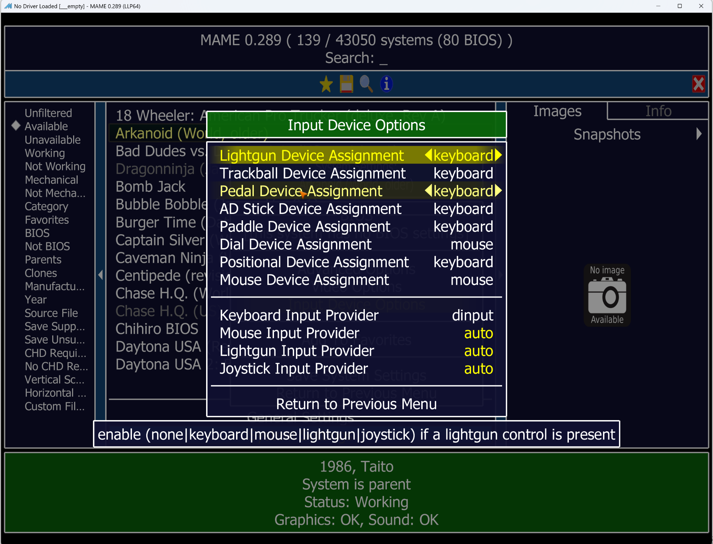
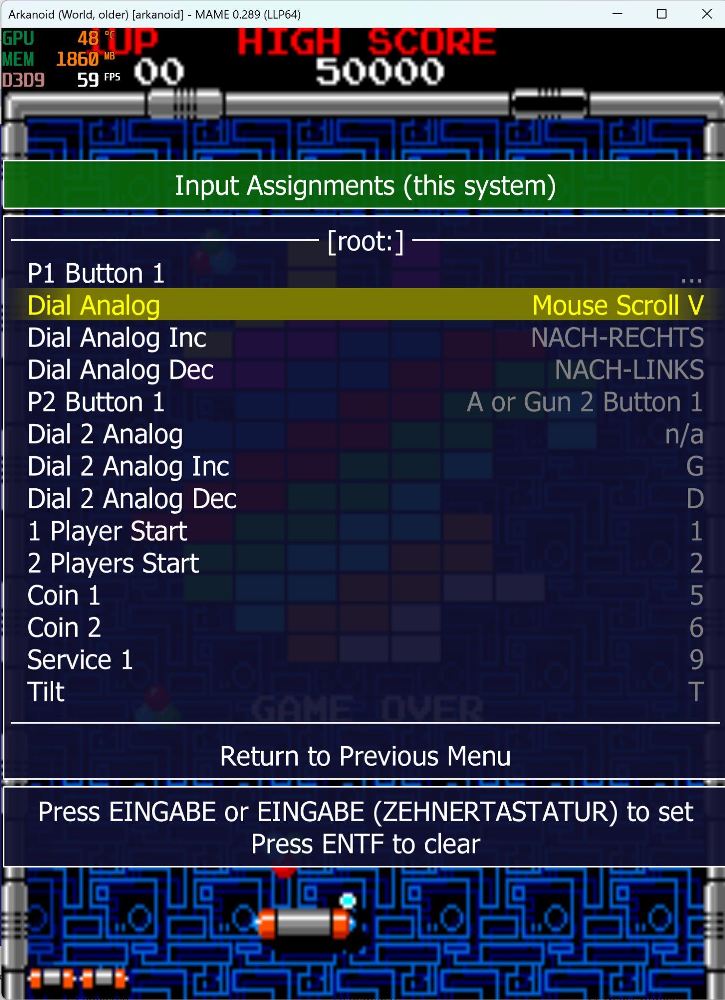
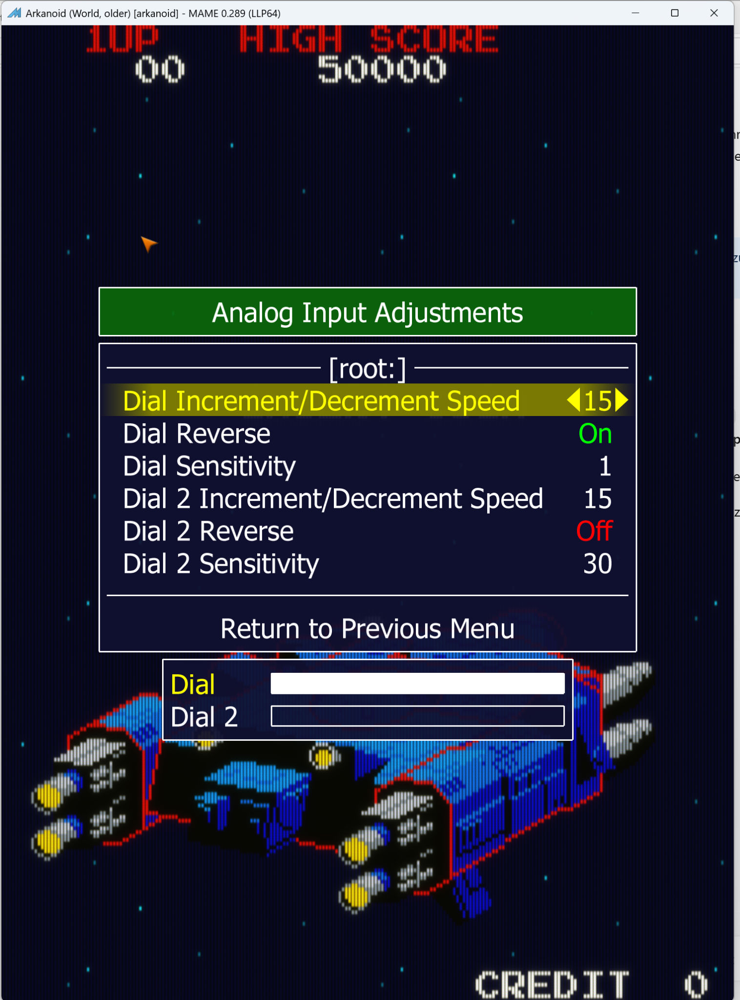
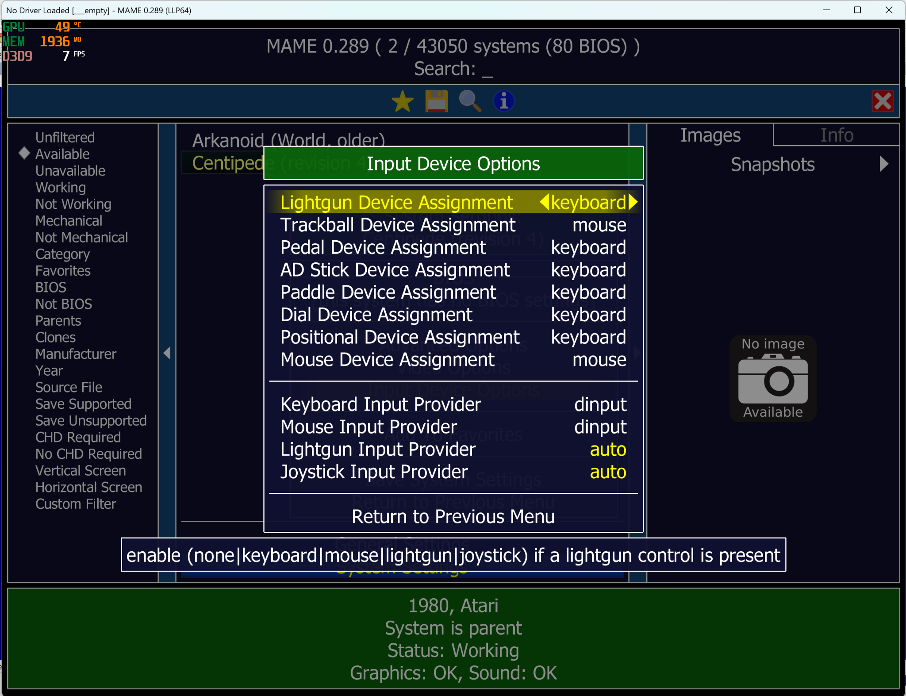
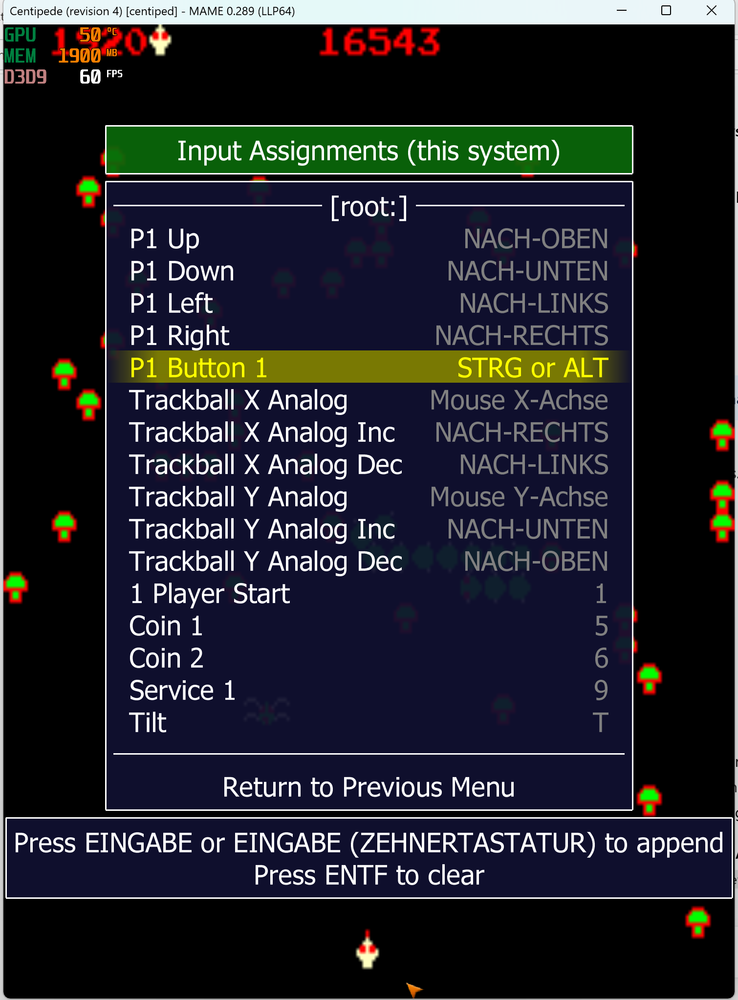
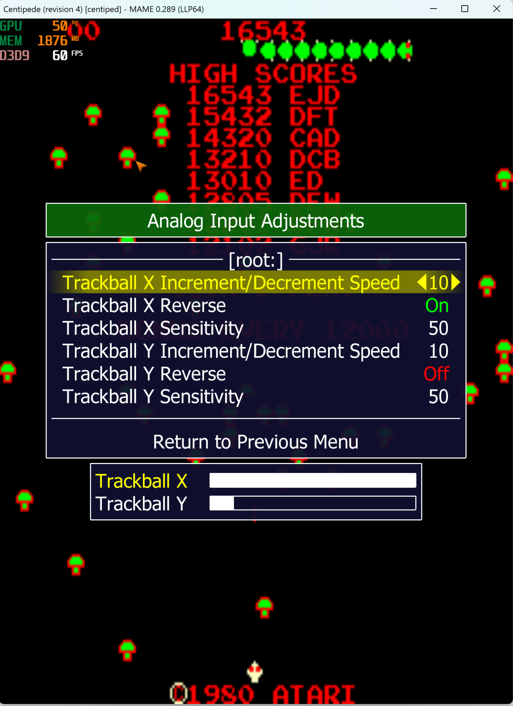

# MAME Setup Guide

This guide describes the recommended MAME configuration for **Egret2MAME Beta 0.815** and the **TAITO EGRET II mini Paddle & Trackball Controller**.

## Reference version

The primary reference is the official standalone Windows build of **MAME 0.289**.

The examples below were tested with:

- **Arkanoid (World, older)** `[arkanoid]` — Spinner / Dial
- **Centipede (revision 4)** `[centiped]` — Trackball

Other MAME versions and frontends may also work, but identical behavior is not guaranteed.

## Egret2MAME button mapping

Egret2MAME Beta 0.815 provides the five controller buttons to MAME as keyboard input:

| EGRET controller button | Keyboard input |
|---|---|
| SELECT | `5` |
| START | `1` |
| MENU | `SPACE` |
| FIRE (L) | `LCTRL` |
| FIRE (R) | `LALT` |

---

# Spinner / Dial Setup — Arkanoid

## 1. Configure MAME Input Device Options

1. Start MAME.
2. Select **Arkanoid (World, older)**.
3. Double-click the game to open **System Settings**.
4. Open **Input Device Options**.
5. Set the following options:

| Setting | Value |
|---|---|
| Dial Device Assignment | `mouse` |
| Keyboard Input Provider | `dinput` |
| Mouse Input Provider | `auto` |

Then select:

**Return to Previous Menu → Save System Settings → ESC**

Back in the game list, start **Arkanoid** with a double-click.

## 2. Assign the spinner

While Arkanoid is running:

1. Press **TAB**.
2. Open **Input Assignments (this system)**.
3. Highlight **Dial Analog**.
4. Press **Enter**.
5. Briefly turn the EGRET spinner.
6. MAME should detect it as **Mouse Scroll V**.

The result should look like this:

**Dial Analog → Mouse Scroll V**

## 3. Recommended analog settings

Open:

**TAB → Analog Input Adjustments**

The following values were tested successfully with Arkanoid:

| Setting | Recommended value |
|---|---:|
| Dial Increment/Decrement Speed | `15` |
| Dial Reverse | `On` |
| Dial Sensitivity | `1` |

These values are **recommendations only**. Feel free to experiment with **Sensitivity**, **Reverse**, and **Increment/Decrement Speed** until the spinner feels right for you and for the particular game.

## 4. Fire button

Under:

**TAB → Input Assignments (this system)**

assign **P1 Button 1** according to your preference.

Egret2MAME provides:

- Left fire button → `LCTRL`
- Right fire button → `LALT`

You can use either button or assign **both as alternatives** for P1 Button 1.

---

# Trackball Setup — Centipede

## 1. Configure MAME Input Device Options

1. Start MAME.
2. Select **Centipede (revision 4)**.
3. Double-click the game to open **System Settings**.
4. Open **Input Device Options**.
5. Set the following options:

| Setting | Value |
|---|---|
| Trackball Device Assignment | `mouse` |
| Keyboard Input Provider | `dinput` |
| Mouse Input Provider | `dinput` |

Then select:

**Return to Previous Menu → Save System Settings → ESC**

Back in the game list, start **Centipede** with a double-click.

## 2. Check the trackball assignments

While Centipede is running, open:

**TAB → Input Assignments (this system)**

The analog trackball inputs should be assigned as follows:

| MAME input | Assignment |
|---|---|
| Trackball X Analog | `Mouse X Axis` |
| Trackball Y Analog | `Mouse Y Axis` |

The same screen also shows the standard Egret2MAME mappings for **Start (`1`)**, **Coin (`5`)**, and the fire buttons.

## 3. Recommended analog settings

Open:

**TAB → Analog Input Adjustments**

The following values were tested successfully with Centipede:

| Setting | Recommended value |
|---|---:|
| Trackball X Increment/Decrement Speed | `10` |
| Trackball X Reverse | `On` |
| Trackball X Sensitivity | `50` |
| Trackball Y Increment/Decrement Speed | `10` |
| Trackball Y Reverse | `Off` |
| Trackball Y Sensitivity | `50` |

These values are **recommendations only**. Trackball sensitivity in particular can be adjusted to taste. Try different values until the speed and response feel right for the game you are playing.

## 4. Fire button

Under:

**TAB → Input Assignments (this system)**

assign **P1 Button 1** to either EGRET fire button, or to both:

- `LCTRL`
- `LALT`
- `LCTRL OR LALT`

The Centipede example above uses both fire buttons as alternatives.

---

# Other Spinner and Trackball Games

The procedure above was tested with **Arkanoid (World, older)** and **Centipede (revision 4)** under **MAME 0.289**.

The same basic setup should work with other MAME games that use a **spinner/dial or trackball**:

- Select `mouse` as the appropriate MAME device assignment.
- Check or assign the game's analog axis in **Input Assignments (this system)**.
- Adjust the game's analog settings to taste.

The sensitivity, reverse, and increment/decrement values shown in this guide are **recommended starting points only**. Different games can feel better with different settings, so feel free to experiment.

## If trackball movement feels wrong

During Egret2MAME development, an old or modified MAME configuration once caused trackball movement to behave incorrectly and appear to recenter unnaturally.

If a game behaves incorrectly even when Egret2MAME is not running, test with clean MAME configuration files before assuming the controller bridge is at fault.

Back up any mappings you want to keep before removing configuration files. Typical files to inspect are:

- `cfg/default.cfg`
- the individual game's file under `cfg/`

For the Centipede development test, resetting the affected MAME configuration restored normal smooth mouse/trackball behavior.

## Game behavior still matters

Egret2MAME changes the input delivered to MAME; it does not change the original arcade game's movement rules. A game can impose its own maximum movement speed even when the physical trackball is spun faster.
